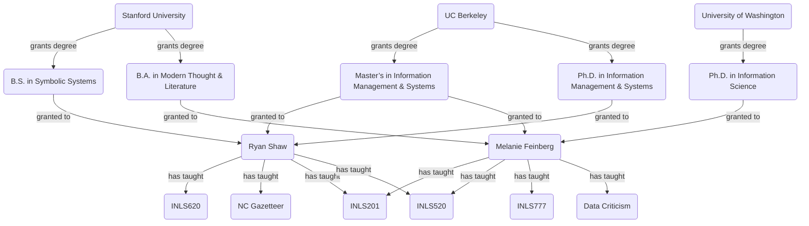
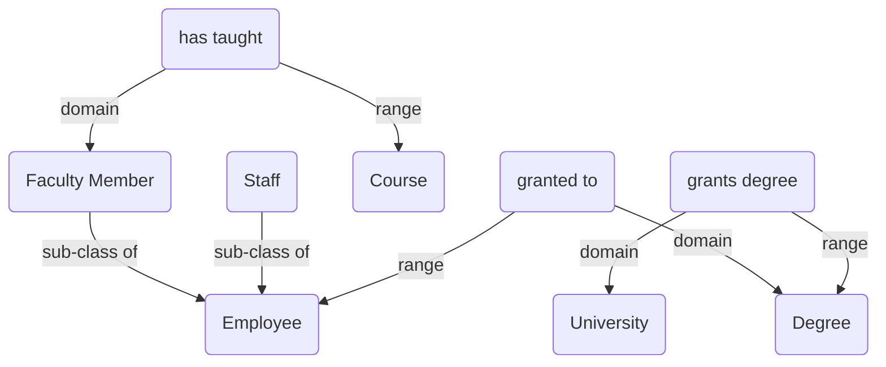

# Data modeling

## 1 Choose your scope and purpose

Data modeling is always done for a purpose. Ordinarily, that purpose is
communicated to you by whoever has hired you to model their data. For
this assignment, you will choose your own purpose to help motivate your
data modeling.

So: is your purpose to create a *map*, a *blueprint*, or a *mind*?

* One possible purpose is to create a **map for navigating a complex
  topic or domain**. (A *domain* is a sphere of activity or
  knowledge). The map would help people browse around and learn from
  documents about or important to the topic or domain.
  
  *For example:* a digital exhibit of archival documents, or an
  interactive organic chemistry textbook.

* Another possible purpose is to create a **blueprint for constructing
  a information system**. The blueprint would help the different
  people working on and using the system come to a common
  understanding of the domain.
  
  *For example:* an investing app that where the domain is the
  investing process works and relevant legal regulations, or a
  “virtual lab” where the domain is organic chemistry.

* A third possible purpose is to create a **mind for reasoning about
  some domain**. The “mind” would be able make inferences about the
  domain, potentially enriching the existing data.
  
  *For example:* reasoning about genealogical data may infer temporal
  bounds (earliest and latest possible dates) on the lives of people
  represented in that data whose birth and death dates are unknown, on
  the basis of their family relations and “common sense” assumptions
  like “a person’s birth date is always later than the birth date of
  their biological mother.” Reasoning about biomedical data may infer
  previously unrecognized relations among biological entities, on the
  basis of scientific classifications of those entities.

For the examples here, I'm going to assume that I'm mapping out “the
SILS domain” for the purpose of keeping organized SILS-related
resources such as the SILS website and intranet.

## 2 Choose your source of information

Ordinarily you would have many different sources of information, but
for the purposes of this assignment you will choose just one.

Find a relatively short textual description of something that you
would like to model. Choose something that will allow you identify a
few different “things being talked about” and relations among
them. Relatively straightforward factual accounts of something that
happened usually work well.

For example:

* The people, places, and artifacts related to the Highlander Research
  and Education Center, as described in the abstract of [the Southern
  Folklife Collection’s finding
  aid](https://finding-aids.lib.unc.edu/20361/).
* The history of and entities involved in the [merger of Sprint
  Corporation and T-Mobile
  US](https://en.wikipedia.org/wiki/Merger_of_Sprint_Corporation_and_T-Mobile_US).
* What happens when [methane
  combusts](https://en.wikipedia.org/wiki/Methane#Combustion).
* The [contested history of the first rooftop solar
  panel](https://www.bellingcat.com/news/2023/08/16/untangling-the-mystery-of-the-worlds-first-rooftop-solar-panel/).

For the examples here, I’m assuming that my source of information is
the SILS website.

## 3 Create a graph-structured description

Your source provides information about some entities. Depending on the
domain, these entities might be people, places, reels of film, audio
cassettes, corporations, legal jurisdictions, court judgments,
chemical elements, molecules, chemical reactions, inventors,
publishers, photographs, buildings … *anything*.

Choose **just a few** of these individual entities that are related to
one another. Describe **only these specific entities** and their
relations by creating a graph structure where the entities are
**nodes**, and their relations are **directed edges**.

For example, a graph describing SILS faculty and the courses they’ve
taught might include:

To guide your describing, write a couple of specific questions that
could be answered using your graph (if it were complete).

**Your graph should have just enough description to illustrate how the
questions would be answered, and no more.**

For example, the graph above could be used to answer these specific
questions:

* *Q:* Who has a degree from the University of Washington?

  *A:* Melanie

* *Q:* Which courses have Ryan and Melanie both taught?

  *A:* INLS201 & INLS520

Your questions should relate to the purpose and scope you envisioned.

## 4 Add some “semantics”

If you’ve followed the steps above, you have a graph describing some
entities and their relations. Now, you will add some description of
the kinds or *classes* to which those entities belong, and the
*properties* to which their relations belong. Usually this just
involves making explicit some assumptions you already made when
creating your graph.

So, for example, the graph above describes four classes of things:

* Faculty Member
* Degree
* University
* Course

That might seem more or less clear to someone looking at the graph,
but it isn’t (yet) explicitly stated anywhere in the graph itself.

Identify the classes of things described in your graph. Give each
class a name and a brief description, like this:

| Class | Description |
| ----- | ----------- |
| Faculty Member | A person who has taught at least one course at UNC SILS |
| Degree | An academic qualification conferred by college or university |
| University | A degree-granting institution |
| Course | A course that has been taught at UNC SILS |

Note how descriptions may further narrow and define your scope—for
example, here I try to make it clear that `Course` only is intended for
courses at SILS, not any course anywhere.

Next, list and describe the different *properties*, or kinds of
relation, in your graph. For example:

| Property | Description |
| -------- | ----------- |
| grants degree | relates a University to a Degree that it grants |
| granted to | relates a Degree to a Faculty Member who has it |
| has taught | relates a Faculty Member to a course they have taught |

Note how each description tells which classes are related by the
property, and the direction in which the property points (for example,
a `University` grants a `Degree`, not vice versa).

Finally, generalize your questions by rephrasing them in terms of the
classes and properties you defined:

* *Q:* Which Faculty Members have a degree from which Universities?
* *Q:* Which Courses have been taught by which Faculty Members?

## 5 Test the flexibility of your classes and properties

Now, go back to your information source. Since you picked just a few
illustrative entities to include in your graph, there should be plenty
more you could potentially add. Without radically changing the purpose
and scope of your model, consider these potential additions, and make
any changes to your class and property definitions that you think are
warranted.

For example, we might note that not only SILS Faculty Members but also
Staff may hold Degrees.

This suggests that we should revise our definition of the `granted to`
property:

| Property | Description |
| -------- | ----------- |
| granted to | relates a Degree to an Employee who has it |

… add a couple of new classes, `Employee` and `Staff`:

| Class | Description |
| ----- | ----------- |
| Employee | A person who has been hired by UNC SILS |
| Staff | A person who has held a staff position at UNC SILS. Sub-class of Employee |

… and revise our definition of the `Faculty Member` class:

| Class | Description |
| ----- | ----------- |
| Faculty Member | A person who has taught at least one course at UNC SILS. Sub-class of Employee |

Note how the descriptions of `Staff` and `Faculty Member` explicitly
state that they are sub-classes of `Employee`. (Class `X` is a
sub-class of class `Y` if every `X` is also a `Y`, but not every `Y`
is also a `X`.)

Now the `granted to` property is more flexible, because it can be used
to describe the degrees granted to any employee, not just faculty
members.

## 6 Graphing your classes and properties

Finally, create a graph showing how your classes and properties relate
to each other.

You should have already identified the classes related by each
property. For example, `granted to` relates a `Degree` to an
`Employee` who has it.

Because `granted to` points from some entity in the `Degree` class to
some entity in the `Employee` class, we say that its **domain** is the
`Degree` class, and its **range** is the `Employee` class.

So, your graph should show these `domain` and `range` relations
between properties and classes. If you identified any sub-class
relations between classes, be sure to include these too.

For example:

## 8 Deliverables

To complete and submit this assignment:

1. Edit the following two files, as described above:

   * [description.md](description.md) should include:
     * a brief (1–3 sentences) description of [your imagined scope and
       purpose](#1-choose-your-scope-and-purpose)
     * a brief (1–3 sentences) description of [your information
       source](#2-choose-your-source-of-information)
     * your [graph-structured description of specific
       entities](#3-create-a-graph-structured-description) that your
       source provides information about
     * your specific questions that this graph can answer
   * [vocabulary.md](vocabulary.md) should include:
     * your revised [class definitions and property definitions](#4-add-some-semantics)
     * your [graph-structured description of classes and
       properties](#6-graphing-your-classes-and-properties) that your
       source provides information about
     * your generalized questions that this graph can answer

   To guide you, I've included example content in these two files.

   **Do not submit this example content; replace it with your own.**

2. Stage and commit your changes to these two files.

3. Synchronize the committed changes to your fork of the assignment
   repository.

## Getting help

If you need help or want feedback on your work, first [push your
changes from your codespace to your repository][push]. Then, send me a
direct message in Zulip asking me to take a look at your repository.

If you're having trouble pushing your changes, first post a question
on Zulip and see if one of your classmates can help you.

If you're really stuck, [make an appointment for my office hours][oh].

[push]: <https://docs.github.com/en/codespaces/developing-in-a-codespace/using-source-control-in-your-codespace>
[oh]: <https://fantastical.app/ryanshaw/office-hours>
