# Description

## Scope and purpose

I'm mapping out "the SILS Splunk index" so engineers and analysts can categorize logs into System vs Application groups,
map each LogGroup to its sourcetypes, and power dashboards, alerts, and data quality checks with a shared schema.

## Information source

My source of information is from the Splunk dashboard and my Splunk Visualization project[https://www.sidneychen.cc/projects/Splunk_visualization]

## Graph-structured description of entities and relations

```mermaid
flowchart TD
    %% Entities
    INDEX(Index=SILS)

    SYS(System-related)
    APP(Application)

    SYSLOGS(System Logs)
    AUTLOGS(Authentication Logs)
    DIAGMSGLOGS(Diagnostic Messages Logs)
    KERLOGS(Kernel Logs)
    PACKMANAMENTLOGS(Package Management Logs)
    MAILLOGS(Mail Logs)
    SUDOLOGS(Sudo Logs)

    ZABBIX(Zabbix)
    AUDIT(File Audit)
    PUPPET(Puppetlab)
    APACHE(Apache)
    DATABASE(Database)
    PHP(Php)
    VAULT(Vault)
    SHIBBOLETH(Shibboleth)

    LMS(linux_messages_syslog)
    LS(linux_secure)
    DMESG(dmesg)
    PS(postfix_syslog)
    AA(apache:access)
    AE(apache:error)
    
    %% Relations
    INDEX -->|Categorize| SYS
    INDEX -->|Categorize| APP

    SYS -->|hasLogGroup| SYSLOGS
    SYS -->|hasLogGroup| AUTLOGS
    SYS -->|hasLogGroup| DIAGMSGLOGS
    SYS -->|hasLogGroup| KERLOGS
    SYS -->|hasLogGroup| PACKMANAMENTLOGS
    SYS -->|hasLogGroup| MAILLOGS
    SYS -->|hasLogGroup| SUDOLOGS

    APP -->|hasLogGroup| ZABBIX
    APP -->|hasLogGroup| AUDIT
    APP -->|hasLogGroup| PUPPET
    APP -->|hasLogGroup| DATABASE
    APP -->|hasLogGroup| APACHE
    APP -->|hasLogGroup| PHP
    APP -->|hasLogGroup| VAULT
    APP -->|hasLogGroup| SHIBBOLETH

    SYSLOGS -->|besourcetype| LMS
    AUTLOGS -->|besourcetype| LS
    DIAGMSGLOGS -->|besourcetype| DMESG
    KERLOGS -->|besourcetype| LMS
    PACKMANAMENTLOG -->|besourcetype| LMS
    MAILLOGS -->|besourcetype| PS
    SUDOLOGS -->|besourcetype| LS
    ZABBIT -->|besourcetype| LS
    AUDIT -->|besourcetype| LS
    PUPPET -->|besourcetype| LS
    APACHE -->|besourcetype| AA
    APACHE -->|besourcetype| AE
    PHP-->|besourcetype| LS
    DATABASE-->|besourcetype| LS

    

```

## Questions this graph can answer

* *Q:* Which categories does the SILS index contain?

  *A:* Index → Categorize → System/Application

* *Q:* Which LogGroups belong to SystemCategory vs ApplicationCategory?

  *A:* hasLogGroup

* *Q:* Which applications are represented and what sourcetypes do they map to?

  *A:* Application → sourcetypes
  