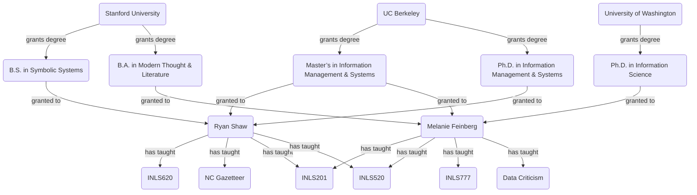

# Description

## Scope and purpose

I'm mapping out “the SILS domain” for the purpose of keeping organized
SILS-related resources such as the SILS website and intranet.

## Information source

My source of information is the SILS website.

## Graph-structured description of entities and relations

## Questions this graph can answer

* *Q:* Who has a degree from the University of Washington?

  *A:* Melanie

* *Q:* Which courses have Ryan and Melanie both taught?

  *A:* INLS201 & INLS520
