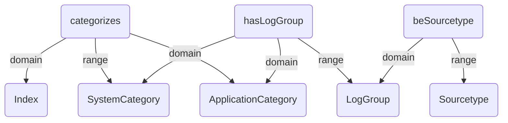

# Vocabulary

## Class definitions

| Class | Description |
| ----- | ----------- |
| Index | A Splunk index (e.g. SILS) |
| SystemCategory | Holds system-related log groups |
| ApplicationCategory | Holds application log groups |
| LogGroup | A logical grouping of logs (e.g. System Logs, Mail Logs) |
| Sourcetype | Splunk sourcetype that describes the data format |

## Property definitions

| Property | Description |
| -------- | ----------- |
| categorizes | Index categorizes its major categories |
| hasLogGroup | A system category has log groups |
| applicationSourcetype | An application maps to one or more sourcetypes |

## Graph-structured description of classes and properties

## Questions this graph can answer

* *Q:* What categories does the SILS index categorize?
* *Q:* Which applications in a given Splunk index are associated with which sourcetypes?
