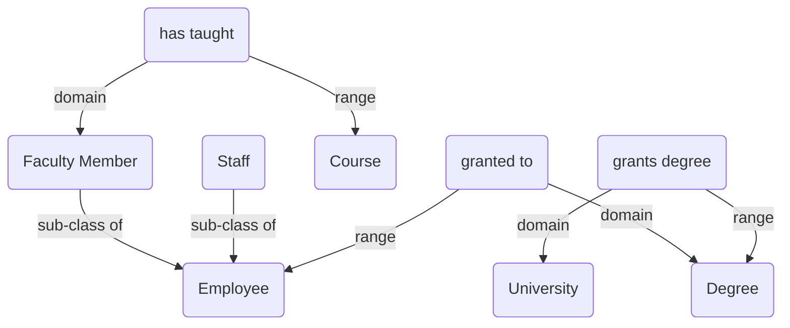

# Vocabulary

## Class definitions

| Class | Description |
| ----- | ----------- |
| Employee | A person who has been hired by UNC SILS |
| Staff | A person who has held a staff position at UNC SILS. Sub-class of Employee |
| Faculty Member | A person who has taught at least one course at UNC SILS. Sub-class of Employee |
| Degree | An academic qualification conferred by college or university |
| University | A degree-granting institution |
| Course | A course that has been taught at UNC SILS |

## Property definitions

| Property | Description |
| -------- | ----------- |
| grants degree | relates a University to a Degree that it grants |
| granted to | relates a Degree to a Faculty Member who has it |
| has taught | relates a Faculty Member to a course they have taught |

## Graph-structured description of classes and properties

## Questions this graph can answer

* *Q:* Which Faculty Members have a degree from which Universities?
* *Q:* Which Courses have been taught by which Faculty Members?
